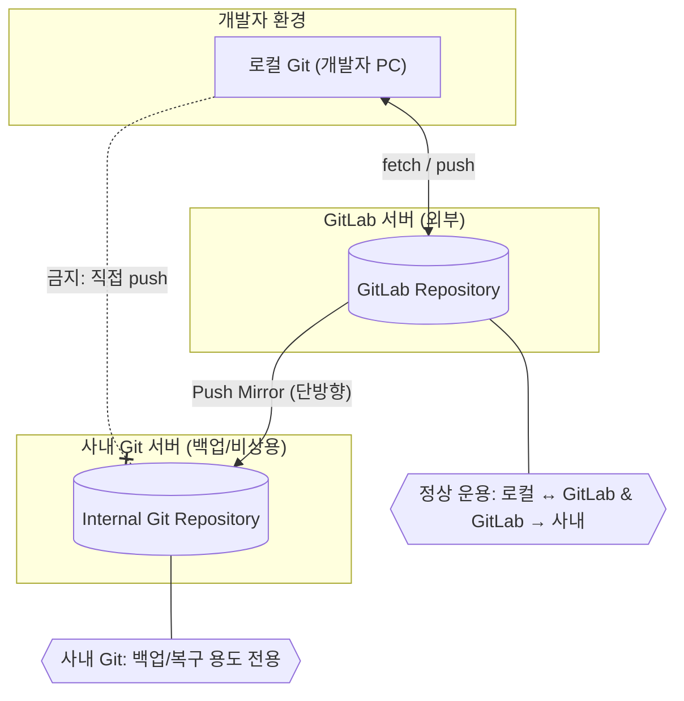

## 1. 개요

본 문서는 **사내 Git 서버의 레포지토리를 플랫폼팀 GitLab 서버로 이전**하고,

이후 **GitLab → 사내 Git 단방향 미러링(백업용)** 구성을 유지하기 위한 절차를 기술한다.

---

## 2. 사전 준비

| 항목 | 설명 |
| --- | --- |
| 사내 Git 접속 정보 | SSH 주소, 포트, 계정 (`git@<내부 Git 서버 IP>`) |
| GitLab 계정 | GitLab 담당자에게 계정 생성 및 접근 권한 요청 |
| SSH 키 | 개발자 환경 및 GitLab 접속용 SSH 키 필요 |

---

## 3. 구성 개요

사내 Git과 GitLab은 서로 분리되어 있으며, 보안 및 관리 목적상 다음과 같은 구조를 따른다.



**핵심 규칙**

- ✅ 로컬 → GitLab: `fetch / push` 정상 허용
- ✅ GitLab → 사내 Git: 단방향 **Push Mirror**
- 🚫 로컬 → 사내 Git: 직접 Push 금지
- 🧩 사내 Git은 **백업 및 비상 복구용으로만 사용**

---

## 4. GitLab 설정 절차

### 4.1 로그인 및 보안 설정

1. 담당자에게 로그인 계정 정보 요청
2. 로그인 후 **2FA(2단계 인증)** 설정
3. **SSH Key 등록**
    
    ```bash
    ssh-keygen -t rsa
    chmod 700 ~/.ssh
    chmod 600 ~/.ssh/id_rsa
    chmod 644 ~/.ssh/id_rsa.pub
    
    ```
    
    - `~/.ssh/id_rsa.pub` 파일 내용을 복사
    - GitLab → **User Settings → SSH Keys → Add new key** 메뉴에서 등록

---

## 5. 프로젝트 생성 및 코드 푸시

- 화면 좌측 상단 + 버튼 → New Project/Repository → Create blank project
    
    
    
- Visibility Level : Internal
- Initialize repository with a README 체크 해제
- Create project

- 빈 레포지터리 화면 하단의 기존 레포지터리 푸시 스크립트 복사하여 사용

```bash
git remote rename origin old-origin
git remote add origin ssh://git@<gitlab-domain>:<port>/<group>/<project>.git
git push --set-upstream origin --all
git push --set-upstream origin --tags

```

---

## 6. GitLab → 사내 Git 미러링 설정

- 프로젝트 Settings → Repository → Mirroring repositories → Add new

```
# 다음과 같은 방식으로 경로 입력
ssh://git@<내부 Git 서버 IP>/home/git/<project>.git

```

- **Detect host keys** 클릭 → 정상적으로 fingerprint 인식되는지 확인 → 안 될 경우 경로 재확인
- **Authentication method:** SSH public key
- **Username:** `git`
- 저장 시 **Mirror repository** 클릭

---

## 7. 사내 Git 서버에서 SSH Key 등록

```bash
ssh git@<내부 Git 서버 IP> # 사내깃 접속
vi /home/git/.ssh/authorized_keys 
# 마지막 줄에 GitLab에서 복사한 SSH 키 붙여넣기

```

---

```bash
# 각 프로젝트 루트로 이동 후 실행
# GitLab 계정에 SSH 키 등록되어있어야 실행 가능
# 각 환경별로 (PC마다) SSH 키 등록 필요

# 예시: 프로젝트별로 아래와 같이 실행
git remote rename origin old-origin
git remote add origin ssh://git@<gitlab-domain>:<port>/<group>/<project>.git
git push --set-upstream origin --all
git push --set-upstream origin --tags
```
